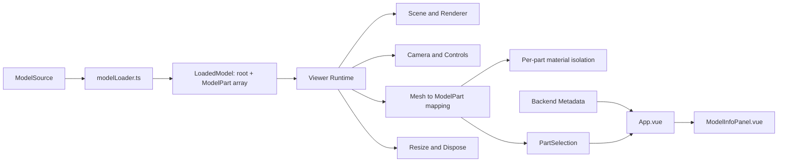

# 项目结构与接口

当前为 V0.2。保留 Cube 冒烟模型，并用独立交互测试模型验证多 Mesh 部件、深层节点和共享材质。无真实 Blender 或 GLB 加载。

## 模型与业务边界



Viewer 不查询后端，不包含业务描述。App 将 Part ID 与后端元数据关联，ModelInfoPanel 只展示业务数据并发送列表选择命令。

## 核心类型

类型定义位于 `frontend/src/models/types.ts`：

```ts
type ModelSource =
  | { type: 'demo' }
  | { type: 'interaction-test' }
  | { type: 'glb'; url: string }

interface ModelPart {
  id: string
  object: THREE.Object3D
  meshes: THREE.Mesh[]
  sourceName?: string
}

interface LoadedModel {
  root: THREE.Object3D
  parts: ModelPart[]
}
```

- `id` 是模型内唯一的稳定业务部件 ID，不要求等于 `object.name`。
- `object` 是部件根节点，用于调试和部件定位。
- `meshes` 显式列出该部件的全部可拾取 Mesh，层级深度不限。
- 一个 Mesh 应只归属一个部件；Loader 负责构建完整、稳定的部件列表。
- `sourceName` 可保留技术来源名称。
- 模型 ID 与模型版本分开管理。

`modelLoader.ts` 提供 `loadModel(source, signal?) => Promise<LoadedModel>`。
`demo` 调用 Cube 工厂，`interaction-test` 调用独立测试模型工厂。
`glb` 仅保留接口并返回 `MODEL_LOAD_ERROR`，包括空 URL；不会隐式回退到 Cube，也不会发起 GLB 请求。

Runtime 只接受 `LoadedModel`，不导入模型工厂或 Loader，不知道模型来源。

## 文件职责

| 文件 | 职责 |
| --- | --- |
| `models/demoCube.ts` | 六面 Cube 冒烟模型。 |
| `models/interactionTestModel.ts` | 三个部件、四个 Mesh、深层 Group 与共享基础材质。 |
| `models/types.ts` | 模型输入、部件、加载结果、选择事件与统计类型。 |
| `models/modelLoader.ts` | 显式来源分派和预留 GLB 边界。 |
| `viewer/runtime.ts` | 消费 LoadedModel，连接渲染、相机、交互与生命周期。 |
| `viewer/scene.ts` | Scene、Renderer 和灯光。 |
| `viewer/camera.ts` | 包围盒取景、四种相机模式与 OrbitControls。 |
| `viewer/interaction.ts` | 显式 Mesh 到 ModelPart 映射、Raycaster、悬停与选择。 |
| `viewer/highlight.ts` | 按部件隔离材质并管理默认、悬停、选中颜色。 |
| `viewer/modelStats.ts` | Mesh、三角形与包围盒统计。 |
| `viewer/dispose.ts` | 模型几何、材质与纹理的去重释放。 |
| `ModelViewer.vue` | Vue 生命周期、Loader 调用、来源切换、取消和错误事件。 |
| `ViewerDebugPanel.vue` | 独立 Debug 视图，默认关闭。 |
| `metadata/validate.ts` | API 数据解析及几何/业务元数据一致性检查。 |
| `errors.ts` | 统一错误类型和诊断结构。 |
| `config.ts` | 前端 API、默认来源、Debug 配置及测试模型目录。 |
| 后端 `app/config.py` | 端口、数据库路径与 CORS 配置。 |

## Viewer 契约

```vue
<ModelViewer
  ref="viewer"
  :source="{ type: 'demo' }"
  :view-mode="viewMode"
  :debug="debug"
  @select="selected = $event"
  @hover="hovered = $event"
  @ready="readyModel = $event"
  @error="viewerIssue = $event"
/>
```

旧 `model-url=""` 契约已经移除。

- `source` 必须显式提供。
- `viewMode`：`perspective`、`front`、`top`、`right`。
- `debug` 默认 false，控制详细诊断日志；App 的 Debug 面板通过独立组件展示信息。
- `select` / `hover`：`{ id, objectName, meshCount } | null`。
- `ready`：`{ parts: PartSelection[], stats: ModelStats } | null`。
- `error`：`{ code, message, detail } | null`。
- 暴露 `selectedPart`、`hoveredPart` 和对应 `selectedObject`、`hoveredObject`。
- 暴露 `selectPart(id | null)` 与 `resetView()`。

同一部件的任意子 Mesh 都映射到同一 ModelPart。选中优先于悬停。
相机切换和重置保留选择；模型来源切换清空选择。

## 材质和资源所有权

材质在初始化时按「原材质 + 部件」克隆一次。同一部件内部继续共享该克隆；不同部件持有不同克隆。
材质数组采用相同规则，纹理引用继续共享。交互过程只修改颜色，不新建材质。

Highlighter 保存原始材质绑定。卸载时先恢复绑定并释放克隆材质，然后由模型释放逻辑去重释放原材质、几何和纹理。
这保证基础材质、克隆材质和共享几何都能释放，且不会因 Hover 次数增加而积累材质。

Loader 将 LoadedModel 的资源所有权交给组件；调用 Runtime 后所有权转交 Runtime。
取消后或过期请求返回的模型由组件释放；Runtime 初始化失败也会释放传入模型。

一个 Viewer = 一个 Runtime = 一个 Renderer = 一条 RAF。
相机切换只更换 Controls。卸载取消 RAF、DOM 事件、ResizeObserver，再释放 Controls、模型和 Renderer。
来源键变化时替换 canvas，Watcher 在 DOM 更新后初始化，避免复用已丢失的 WebGL 上下文。

## 元数据和错误

解析 API JSON 时检查模型 ID、版本、名称、描述、parts 类型与 part_count。
部件 ID 不合法的记录被跳过；缺失名称或描述产生诊断，UI 使用部件 ID 和信息暂不可用提示。

一致性检查覆盖重复几何 ID、重复元数据 ID、几何缺少元数据、元数据没有对应几何。
这些问题不阻止 Renderer 或 Raycaster 工作。问题可在 Debug 面板和开启 Debug 后的日志中查看。

| 代码 | 来源 |
| --- | --- |
| NETWORK_ERROR | 连接或超时失败、健康服务不可用。 |
| MODEL_NOT_FOUND | 模型元数据接口返回 404。 |
| MODEL_LOAD_ERROR | 模型来源不支持或 Viewer 初始化失败。 |
| METADATA_LOAD_ERROR | 元数据接口返回其他失败状态。 |
| INVALID_METADATA | 无效 JSON、结构或必填字段缺失。 |
| PART_ID_MISMATCH | 几何部件与元数据 ID 不一致。 |
| DUPLICATE_PART_ID | 几何或元数据存在重复 ID。 |

正常 UI 显示友好状态；错误代码和详细上下文只在 Debug 区域显示。
App 对切换来源的 API 请求进行取消，避免过期元数据覆盖当前模型。

## 后端契约

- `GET /api/health`：`{"status":"ok"}`。
- `GET /api/models`：模型摘要列表，含 `id/version/name/description/model_url/part_count`。
- `GET /api/models/{id}`：摘要加 `parts: [{id,name,description}]`。
- `GET /api/models/{id}/parts`：部件元数据。
- 未知模型返回 404 和 `MODEL_NOT_FOUND`。

`model_assets` 保存模型当前版本与描述；`model_parts` 以 `(model_id, id)` 为主键。
当前保存一个模型的当前版本，不实现多版本资产管理。

初始化读取 `metadata/*.json`。模型已存在时不覆盖已有记录。
旧版 SQLite 仅做一次兼容操作：为 model_assets 增加 version 列，默认 1.0.0，保留其他数据。
没有引入 Alembic 或通用迁移框架，API 继续只读。

## 配置和运行

根 `.env` 管理共享端口及默认值，根和前后端均提供 `.env.example`。
前端配置优先级为 shell 环境 > frontend/.env > 根 .env；后端为 shell 环境 > backend/.env > 根 .env。
共享端口在根配置维护，前后端专用配置只覆盖各自参数。

`DATABASE_PATH` 相对项目根目录解析。`DATABASE_URL` 可覆盖路径，按 SQLAlchemy URL 语义处理。
启动脚本位于 `scripts/`，安装和启动不引入 Docker，端口占用会明确报错。

Debug 默认关闭。开发环境使用模型标题右侧的 Debug 图标开启；设置 `VITE_VIEWER_DEBUG=true` 后重启也可默认开启。
生产默认关闭且隐藏开关；只有显式配置 true 时才启用。

## 架构冻结与 GLB 接入

本轮完成后暂停继续抽象。两种测试模型长期保留用于回归验证。
下一阶段以真实导出资产验证当前边界。

预计新增 `models/glbModel.ts` 或等价 Loader 分支：
加载 GLB、建立稳定 ModelPart 映射、处理请求取消与过期资源、补充骨骼/动画资源释放。
修改 modelLoader 的 glb 分支及 App 的显式来源选择；按实际资源扩展 dispose。
Runtime、相机、拾取和业务信息面板继续消费既有契约，只有真实资产暴露明确问题时才调整。
